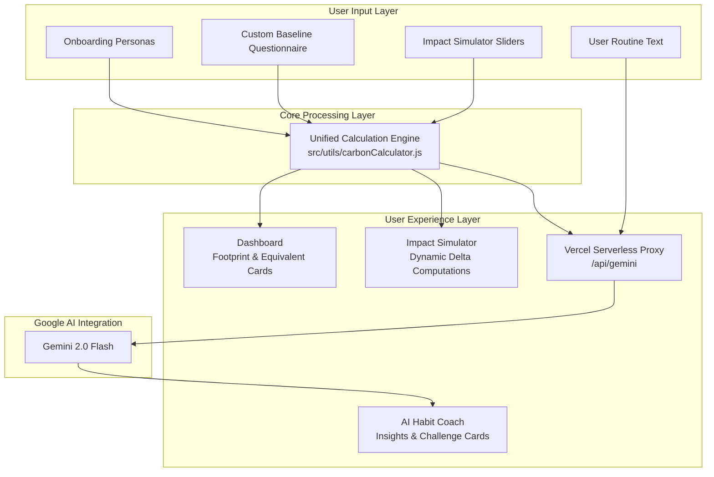

# CarbonCompass 🧭

### *Not Just Measure. Guide.*

[](https://react.dev/)
[](https://vite.dev/)
[](https://tailwindcss.com/)
[](https://deepmind.google/technologies/gemini/)
[](https://vercel.com/)
[](#)

CarbonCompass is a high-fidelity, production-ready personal sustainability application designed to bridge the gap between carbon footprint awareness and actual behavioral change. Developed for the **PromptWars Virtual Hackathon (Challenge 3)**, the platform shifts the focus of carbon tracking away from friction-heavy calculators and passive guilt, instead guiding users toward immediate, contextual, and realistic "Small Wins" powered by a secure serverless Gemini AI implementation.

🔗 **Live Production Link:** [https://prompt-wars-virtual-hackathon.vercel.app/](https://prompt-wars-virtual-hackathon.vercel.app/)

---

## 📖 Executive Summary

Most carbon calculators function as audits: they require complex historical inputs (utility bills, odometer readings) only to present a massive carbon footprint number that induces eco-anxiety without offering realistic paths to reduction.

**CarbonCompass changes the paradigm:**
1. **Frictionless Entry**: Reduces onboarding to under 10 seconds using predefined regional personas.
2. **Deterministic Integrity**: Uses a single, audited calculation engine to guarantee absolute consistency across all application views.
3. **Actionable AI Personalization**: Employs **Gemini 2.0 Flash** strictly as a personalization and behavioral layer. It interprets verified calculation outputs to recommend highly targeted, low-cost "Small Wins" tailored to the user's highest emissions category.

---

## 🚨 Problem Statement: Why Carbon Tracking Fails

Traditional environmental calculators suffer from three major design flaws:
* **The "Audit Barrier"**: Forcing users to supply precise, hard-to-find data points (e.g., exact kWh usage, waste weights) upfront leads to massive drop-off rates during onboarding.
* **Passive Anxiety (Guilt without Guidance)**: Presenting a final emissions number in tonnes of CO2e lacks immediate, human-scale meaning and fails to provide a concrete starting point.
* **Out-of-Touch Structural Advice**: Recommending high-cost, long-term modifications (e.g., "Install solar panels", "Buy a hybrid car") ignores everyday consumer constraints and budgets.

### Our Solution
CarbonCompass focuses on **micro-behaviors**. We translate a user's macro-baseline footprint into a set of immediate, daily adjustments ("Small Wins") that cost under ₹500/month, require less than 10 minutes of effort, and target their highest emission area.

---

## 🎨 Application Interface Preview

> [!NOTE]
> Below are the target visual highlights of the CarbonCompass interface. Use these markers when inspecting the live application:

1. **Onboarding Persona Selector:** Pick pre-configured profiles (Suburban Commuter vs. Eco-Conscious Student) or complete a 3-step baseline.
   * *[Insert Screenshot: Onboarding / Persona Selector]*
2. **Main Dashboard:** Dynamic category breakdown (Transport, Energy, Diet, Waste) showing exact weekly totals.
   * *[Insert Screenshot: Emissions Dashboard]*
3. **Zero-Latency Impact Simulator:** Slide to dynamically swap commutes, trim appliance usage, and adjust meal types.
   * *[Insert Screenshot: Impact Simulator Tab]*
4. **AI Habit Coach:** OWL-themed coaching interface with live backend status indicators.
   * *[Insert Screenshot: AI Habit Coach Tab]*
5. **Progress & Badges:** Gamified tracker with streak metrics and permanent badge unlocks.
   * *[Insert Screenshot: Progress Tracker]*

---

## 📐 System Architecture & Data Flow

To maintain high data credibility, CarbonCompass implements a strict **Single Source of Truth** topology. A unified calculation engine (`carbonCalculator.js`) serves as the foundation for the entire application, eliminating calculation discrepancies between views.



### Key Architectural Pillars
* **Logic Consolidation**: All metrics (mileage, electricity kWh, meal types, waste weights) are routed through `calculateWeeklyFootprint`. The Dashboard and the Impact Simulator consume the exact same formulas.
* **Stateless UI Views**: Components do not compute emission values locally; they receive structured outputs from the core engine, guaranteeing number reconciliation.

---

## 🤖 AI Design Philosophy

> "Deterministic logic for measurement. Generative AI for personalization."

Generative AI models are notoriously unreliable at arithmetic. In CarbonCompass, **Gemini 2.0 Flash does not perform carbon calculations**. Instead, it acts as a behavioral strategist that interprets verified outputs.

### 1. Separation of Concerns
1. The frontend calculates the user's weekly carbon footprint and identifies their highest-impact category using the deterministic engine.
2. The frontend sends these calculated inputs, along with a free-text description of the user's daily routine, to the serverless proxy.
3. Gemini receives these structured numbers and maps them to a behavioral profile, returning structured feedback and daily habits.

### 2. Prompt Constraints & JSON Schema Enforcement
The model is strictly bound via prompt instructions and SDK-level parameters to guarantee output safety and parser reliability:
* **JSON Output MimeType**: Enforces output conformance using `responseMimeType: "application/json"`.
* **The "Small Wins" Rule**: Enforces that all suggested challenges must require **under 10 minutes of effort**, cost **under ₹500/month (ideally free)**, and target the identified highest-emission category.

### 3. Secure Vercel Serverless Proxy
To protect the Gemini API credentials in production, the application employs a serverless handler on Vercel's backend:

```javascript
// api/gemini.js
import { GoogleGenerativeAI } from '@google/generative-ai';

export default async function handler(req, res) {
  if (req.method !== 'POST') return res.status(405).json({ error: 'Method Not Allowed' });

  try {
    const { prompt } = req.body;
    const apiKey = process.env.GEMINI_API_KEY;
    const genAI = new GoogleGenerativeAI(apiKey);
    const model = genAI.getGenerativeModel({
      model: 'gemini-2.0-flash',
      generationConfig: { responseMimeType: 'application/json' },
    });

    const result = await model.generateContent(prompt);
    return res.status(200).send(result.response.text());
  } catch (error) {
    return res.status(500).json({ error: 'Internal Server Error' });
  }
}
```

---

## 📊 Emission Factors & Methodology

CarbonCompass uses scientific coefficients sourced from reputable, validated environmental databases:

| Category | Emission Coefficient | Primary Source | Details / Context |
| :--- | :--- | :--- | :--- |
| **Electricity (India Grid)** | `0.75 kg CO2/kWh` | Central Electricity Authority (CEA) | Reflects coal-dominant power generation baseline in India. |
| **LPG Cooking Cylinders** | `42.0 kg CO2 / 14.2kg cyl` | CarbonCrux Baseline Databases | Standard combustion footprint of 2.96 kg CO2 per kg of LPG. |
| **Petrol Passenger Car** | `150.0 g CO2/km` | CarbonCrux Fleet Mix | Typical tailpipe emissions for small-to-midsize gasoline vehicles. |
| **Diesel Passenger Car** | `190.0 g CO2/km` | CarbonCrux Fleet Mix | Tailpipe emissions for standard commuter diesel vehicles. |
| **Petrol Scooter / 2W** | `42.5 g CO2/km` | CarbonCrux Fleet Mix | commuter single-cylinder 100-125cc gasoline scooters. |
| **Motorcycle / Bike** | `35.0 g CO2/km` | CarbonCrux Fleet Mix | Geared 110-150cc commuter motorcycles. |
| **Bus Transit** | `89.0 g CO2/passenger-km` | Defra GHG Reporting (India Proxy) | Passenger share assuming standard transit occupancy. |
| **Electric Train** | `12.5 g CO2/passenger-km` | Indian Railways Route Baselines | Grid-powered electric passenger rail routing. |
| **Diet — High Meat** | `7.19 kg CO2e/day` | Scarborough et al. (2014) | Full lifecycle footprint (production to refrigeration). |
| **Diet — Vegetarian** | `3.81 kg CO2e/day` | Scarborough et al. (2014) | Dairy/egg/plant diet. Standard Indian urban proxy. |
| **Diet — Vegan** | `2.89 kg CO2e/day` | Scarborough et al. (2014) | Strictly plant-based lifecycle footprint. |
| **Food Waste** | `2.50 kg CO2 / kg waste` | Poore & Nemecek (Science, 2018) | Agriculture footprint + landfill methane release. |

> [!TIP]
> **Simulator Local-Sourcing Offset:** In the Impact Simulator, if a user's baseline diet is already Vegan, swapping meals applies a further local-produce factor bonus of `-0.4 kg CO2e/day` (reflecting packaging and transit food-mile offsets).

---

## 🔍 Calculation Verification & Testing

To prove mathematical credibility, CarbonCompass features a dedicated CLI validation utility. The script tests the calculator against predefined target outputs calculated by hand for our user personas.

### How to Run the Verification Locally
```bash
node src/utils/verifyCalculator.js
```

### Verification Output Sample
```text
=========================================
CARBONCOMPASS CALCULATION ENGINE VERIFICATION
=========================================

1. Running Verification for Aditi (Student Persona)...
Expected Transport: 4.17 kg | Actual: 4.17
Expected Energy: 12.70 kg    | Actual: 12.7
Expected Diet: 26.67 kg      | Actual: 26.67
Expected Waste: 5.00 kg      | Actual: 5
Expected Total: 48.54 kg     | Actual: 48.54
Result Match status: ✅ SUCCESS (100% Match)

2. Running Verification for Rohan (Tech Professional)...
Expected Transport: 13.70 kg | Actual: 13.7
Expected Energy: 52.76 kg    | Actual: 52.76
Expected Diet: 39.41 kg      | Actual: 39.41
Expected Waste: 11.25 kg     | Actual: 11.25
Expected Total: 117.12 kg    | Actual: 117.12
Result Match status: ✅ SUCCESS (100% Match)
=========================================
```

---

## 🛠️ Tech Stack & Dependencies

* **Frontend Library:** React 19 (Hooks, local storage synchronization)
* **Build System:** Vite 8 (Hot Module Replacement, optimized assets production bundling)
* **Styling Framework:** Tailwind CSS 3 (Dynamic utility classes, grid systems, custom theme transitions)
* **AI Orchestration:** `@google/generative-ai` (Backend serverless proxy integrations)
* **Hosting Platform:** Vercel (Edge network, Serverless function routing)
* **Developer Tooling:** ESLint, Git, Google Antigravity Agentic IDE Plugin

---

## 🚀 Setup & Local Execution

Get a local instance of CarbonCompass running in three steps:

### 1. Clone & Install
Ensure you have **Node.js v18+** installed:
```bash
npm install
```

### 2. Configure Environment variables
Create a `.env` file at the root of the project to enable the local API proxy calls:
```env
GEMINI_API_KEY=your_actual_gemini_api_key
```

### 3. Run the App
Start the local development server:
```bash
npm run dev
```
Open [http://localhost:5173/](http://localhost:5173/) to interact with the application.

---

## 🔮 Future Roadmap

* **⚡ Real-Time IoT Grid Hooks:** Integrate directly with regional grid APIs to adjust energy footprints dynamically based on hourly grid fuel mixes.
* **🌍 Geolocation-Specific Food Lifecycle:** Transition from UK Scarborough dietary proxies to region-specific agricultural lifecycle datasets.
* **💼 Team & Corporate Leaderboards:** Expand gamification elements with team-based challenges and shared offset achievements.
